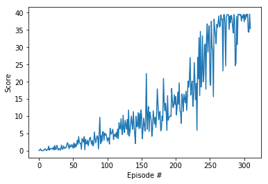

## Report
##### Learning Algorithm
I decided to solve the project by making some amendments to the Deep Deterministic Policy Gradients (DDPG) algorithm.
As base I reused  my Q-Learning algorithm and enhanced it by introduction of Actor+Critic methods, changes in training,
re-used Ornstein-Uhlenbeck process from Udacity RL repo. Also I have used  Gradient Clipping suggested in the lesson. 
I think that results are pretty good but there is still room for improvement, suggested below.

Hyperparameters:
* BUFFER_SIZE = int(1e5)  
* BATCH_SIZE = 128         
* GAMMA = 0.99            
* TAU = 1e-3              
* ACTOR_LR = 2e-4      
* CRITIC_LR = 2e-4               
* UPDATE_EVERY = 10  
* NUM_UPDATES = 5
* NETWORK = 128/128 Both Actor and Critic have two linear layers with additional BatchNorm layer to stabilize training 

*Environment was solved after 210 episodes*

##### Future development
* Originally I have intended to use more agents during training.
 Unfortunately I had some issues with stability and training performance, so I used standard, one-agent setup instead.
First very good idea is to simply use more agents
* DDPG is good algorithm, hoverer I would also like to investigate TRPO, PPO and A3C/ A2C